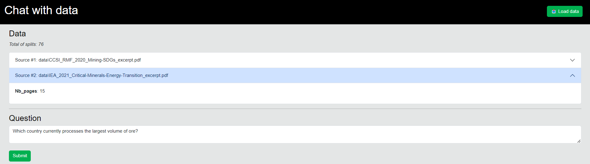
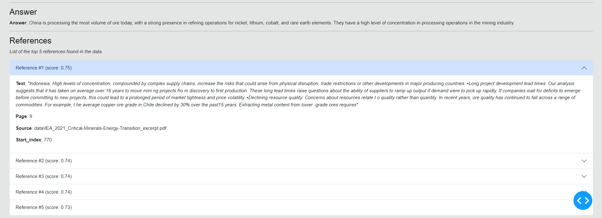

# Chat with your data
This repo contains a dash app that you can run locally to chat with your data using OpenAI API.

## Overview
The app in this report will allow you to:
- load PDF file(s)
- transform and store these files into a document store
- use natural language to ask questions and generate answers based on the files you loaded
- generate references used to answer you

## Setup
In order to run the app, you need to follow these steps:
- create a virtual environemnt
- install requirements using the `requirements.txt` file
- add your OpenAI key as a local env variable `OPENAI_KEY`

## Repo structure
Overview of the folders and files in this repo:
- `app.py`: the main file to run the app
- `requirements.txt`: list of python requirements
- `utils/`: utility python functions for RAGs and Dash app
- `assets/`: assets for this project
- `chroma/`: where ChromaDB files will be created
- `data/`: where the pdf files you load will be stored
- `mooc/`: some usefull ressources from the MOOC [Chat with your data](https://www.deeplearning.ai/short-courses/langchain-chat-with-your-data) from deeplearning.ai
